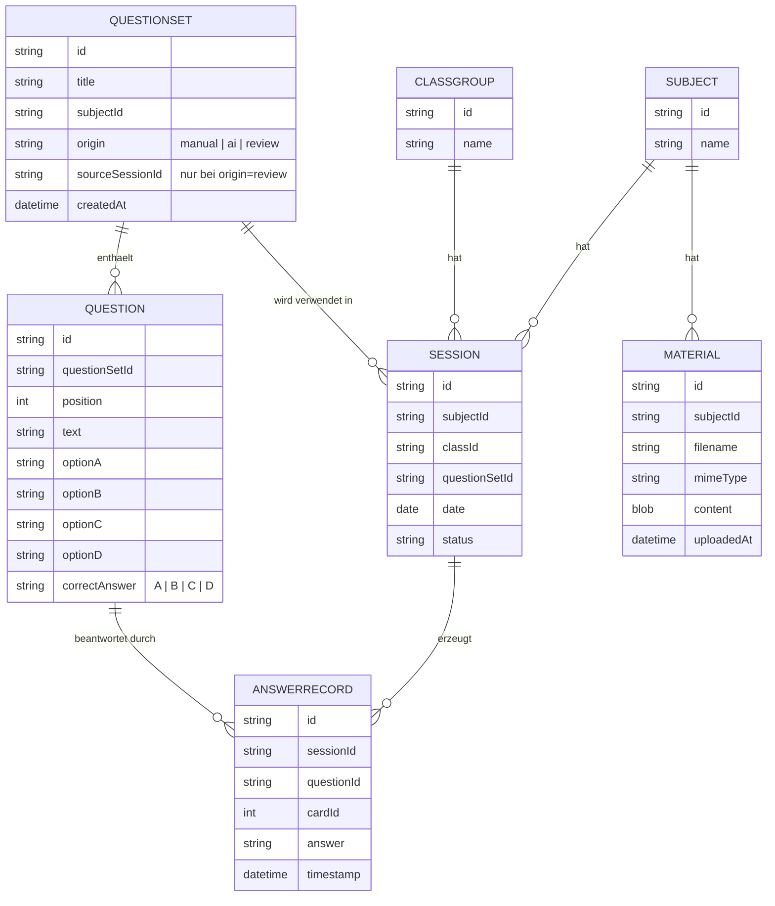
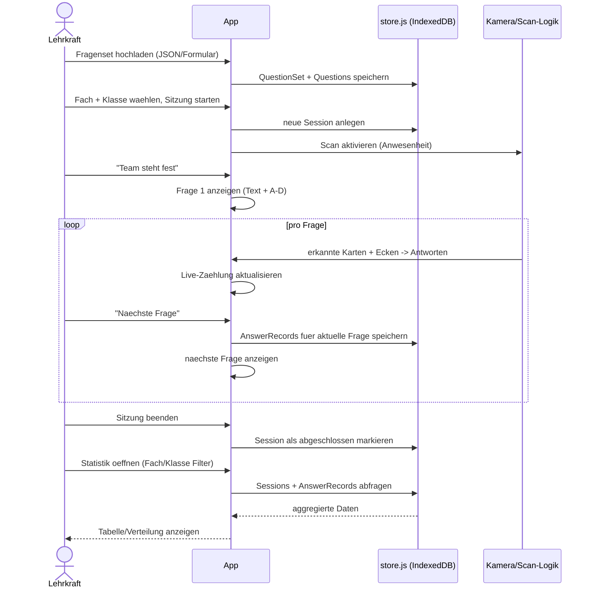

# Architektur: Quiz-Modus für NoNameQuiz

Technische Umsetzung der in [features.md](features.md) beschriebenen Erweiterung.

## Ausgangslage

Die bestehende App ist eine einzelne `index.html` mit reinem JavaScript, ohne
Build-Step und ohne Backend:

- `aruco.js` / `cv.js` / `polyfill.js` — vendorte Bibliothek zur
  Markererkennung ([js-aruco2](https://damianofalcioni.github.io/js-aruco2/)).
- Zustand (`responses`, `activeCards`, `confirmedCards`) lebt nur als
  In-Memory-JS-Variablen im laufenden Tab.
- Es gibt keine Persistenz — schließt man den Tab, sind alle Daten weg.

## Grundentscheidung: Client-only (Phase 1), kein eigener Server

Empfehlung: Die App bleibt eine reine Client-Anwendung, die auf **einem**
Handy/Tablet pro Sitzung läuft, und bekommt eine lokale, strukturierte
Persistenz über **IndexedDB** statt eines Backends.

Begründung:

- Passt zum bisherigen Stil des Projekts (kein Build, kein Server, einfach
  per Datei-Server oder GitHub Pages hostbar, siehe [README.md](README.md)).
- Für den beschriebenen Einsatzzweck (eine Lehrkraft, ein Gerät scannt live
  im Klassenzimmer) ist keine Mehrgeräte-Synchronisation nötig.
- IndexedDB ist im Browser nativ verfügbar, erlaubt strukturierte Abfragen
  (z. B. "alle Sitzungen von Fach X und Klasse Y") und deutlich größere
  Datenmengen als `localStorage`, ohne dass eine Bibliothek oder ein
  externer Dienst nötig wäre.
- `localStorage` wäre hier ungeeignet: nur String-Werte, kein Index/Filter,
  und bei jedem Schreiben müsste der gesamte Datenbestand neu serialisiert
  werden — bei vielen Fragen/Sitzungen über ein Schuljahr unpraktikabel.

Ein optionaler Server-Sync (mehrere Geräte, zentrale Auswertung für mehrere
Lehrkräfte) wird unten als **Phase 2** skizziert, aber bewusst nicht jetzt
gebaut.

**Ausnahme:** Für die KI-gestützte Fragengenerierung und die KI-Tipps
(F8/F10 in `features.md`) wird ein winziger, zustandsloser Server-Proxy
benötigt (siehe Abschnitt ["KI-Komponente"](#ki-komponente-fragengenerierung--tipps)
unten) — nicht, weil die App plötzlich einen Backend-Datenspeicher braucht,
sondern weil ein API-Key für eine KI-API niemals im Client-JavaScript liegen
darf. Der Proxy speichert nichts; IndexedDB bleibt der einzige Datenspeicher
der App.

## Neue Module

Weiterhin reine `<script>`-Dateien ohne Bundler, analog zu `aruco.js` etc.:

| Datei | Aufgabe |
|---|---|
| `store.js` | IndexedDB-Zugriffsschicht: CRUD für Subjects, Classes, QuestionSets, Questions, Sessions, AnswerRecords. Promise-basierte API. |
| `question-editor.js` | UI-Logik für Fragen-Upload (JSON-Import oder Formular), legt QuestionSets/Questions über `store.js` an. |
| `quiz-runner.js` | Verbindet die bestehende Scan-Logik aus `index.html` mit der aktuell aktiven Frage; schreibt Antworten mit Bezug zur `questionId`; löst die Speicherung beim Wechsel zur nächsten Frage aus. |
| `stats-view.js` | Anzeige/Filterung gespeicherter Ergebnisse nach Fach/Klasse/Sitzung. |
| `ai-service.js` | Kommuniziert mit dem KI-Proxy (nicht direkt mit der KI-API): Fragengenerierung zu einem Themenbereich (F8) und Tipps für die Lehrkraft (F10). |
| `export.js` | Bereitet Ergebnisse für den Export auf: Kopieren als HTML-Tabelle in die Zwischenablage (für OneNote), Download als CSV/JSON. |
| `review.js` | Berechnet die Fehlerquote je Frage aus `AnswerRecord` + `Question.correctAnswer` und erzeugt daraus Wiederholungs-Fragensets (F9, Neuformulierung über `ai-service.js`). |
| `materials.js` | Verwaltet hochgeladene Unterrichtsmaterialien pro Fach (Ablage in IndexedDB, Kontext für F8/F9). |

`index.html` bleibt der Einstiegspunkt, bindet die neuen Skripte zusätzlich
zu `aruco.js`/`cv.js`/`polyfill.js` ein.

## App-Struktur / Navigation

Empfehlung: **eine** `index.html` mit umschaltbaren Ansichten (Tabs/Views),
statt mehrerer HTML-Seiten:

1. **Fragen** — Fragenset hochladen/auswählen
2. **Scan** — Fach/Klasse wählen, Anwesenheit sperren, Frage anzeigen, live
   scannen (bestehende Kamera-UI)
3. **Statistik** — gespeicherte Ergebnisse nach Fach/Klasse durchsuchen

Das vermeidet einen Router/ein Framework und passt zur bisherigen
Ein-Datei-Philosophie. Alternative wäre je eine HTML-Datei pro Ansicht
(`fragen.html`, `scan.html`, `statistik.html`), die sich `store.js` teilen —
das würde jede Ansicht einfacher halten, aber Navigation und gemeinsamen
Zustand (aktuelle Session) komplizierter machen. Bei spürbarem Wachstum der
App ist das eine sinnvolle spätere Aufteilung.

Die **Scan**-Ansicht ist zugleich die Präsentationsansicht (siehe
[Präsentationsmodus](#präsentationsmodus-smartboard)): Sie enthält bereits
Frage, Antworten, Kamerabild und Live-Ergebnisse auf einer Seite — genau die
Elemente, die auf dem Smartboard sichtbar sein sollen.

## Präsentationsmodus (Smartboard)

Betrifft F11 aus `features.md`: Frage, Antworten, Kamerabild und
Live-Ergebnisse sollen für die ganze Klasse auf einem Smartboard sichtbar
sein, während das Handy scannt.

**Empfehlung Phase 1 — Bildschirmspiegelung, kein neues Gerät-zu-Gerät-Sync:**
Da die Scan-Ansicht in `index.html` Frage, Antworten, Kamerabild (`<video>`/
`<canvas>`) und Live-Ergebnisse ohnehin auf einer Seite zeigt, reicht es, das
Handy-Display per vorhandener Bordmittel auf das Smartboard zu spiegeln
(Miracast/Smart-View unter Android, AirPlay unter iOS, Chromecast-Tab-Cast,
oder ein HDMI-Kabel). Das erfordert **keine neue App-Architektur** — nur
zwei Anpassungen an der bestehenden Scan-Ansicht:

- Ein **Präsentationsmodus-Toggle**, der die Steuerungselemente der
  Lehrkraft (Anwesenheit sperren, nächste Frage, Team ändern) klein/dezent
  in eine Ecke legt oder ausblendet, damit sie die Projektion nicht stören,
  aber für die Lehrkraft am Gerät weiter erreichbar bleiben.
- Größere, aus der Distanz lesbare Darstellung von Frage, Antworttexten und
  der Live-Verteilung (Layout-/CSS-Anpassung, keine neue Logik).
- **Umgesetzt:** eine `@media (orientation: landscape)`-Regel stellt die
  Scan-Ansicht bei gedrehtem Handy von einer gestapelten Spalte auf zwei
  nebeneinander liegende Bereiche um (`scan-main`: Kamerabild, Frage,
  Ergebnisse; `scan-side`: Steuerung), passend für ein 16:9-Smartboard.
  Zusätzlich wird nur die verarbeitete Canvas (Video + erkannte Marker)
  angezeigt, nicht mehr zusätzlich das unbearbeitete `<video>`-Bild
  darunter — das war dieselbe Aufnahme doppelt.

**Alternative, für später — Companion-Display über zwei Geräte:** Handy
scannt nur, ein zweites Browser-Fenster auf dem am Smartboard angeschlossenen
Rechner zeigt eine eigens aufbereitete Präsentationsansicht, live
synchronisiert (z. B. per WebRTC-Datenkanal oder lokalem WebSocket). Vorteil:
sauberere Darstellung ohne jede Restspur der Scan-Steuerung, unabhängig von
Spiegelungs-Kompatibilität einzelner Geräte/Räume. Nachteil: braucht ein
Pairing/Signaling zwischen den zwei Geräten (z. B. QR-Code mit Sitzungs-ID)
und damit ein weiteres bewegliches Teil, das ausfallen kann — deshalb bewusst
nicht Teil von Phase 1, da die einfache Spiegelung die gestellte
Anforderung bereits erfüllt.

## Datenmodell



Hinweise:

- `Subject` (Fach) und `ClassGroup` (Klasse) sind unabhängige Entitäten. Die
  Verknüpfung "Statistik pro Fach und Klasse" entsteht dadurch, dass jede
  `Session` beides referenziert — das ist flexibler, als Klassen fest an ein
  Fach zu binden.
- `ResultSummary` (Anzahl A/B/C/D je Frage) wird **nicht separat
  gespeichert**, sondern aus den `AnswerRecord`-Einträgen einer Frage
  berechnet (Aggregation zur Anzeigezeit). Das vermeidet inkonsistente
  Doppel-Speicherung; bei Bedarf kann später ein Cache ergänzt werden, falls
  die Aggregation über sehr viele Sitzungen zu langsam wird.
- Die Kartennummer (`cardId`) ist nicht global einer Person zugeordnet,
  sondern nur innerhalb einer Sitzung relevant (siehe Datenschutz-Anforderung
  in `features.md`). Dieselbe physische Karte kann in verschiedenen Klassen
  wiederverwendet werden, ohne Kollisionen zu erzeugen — jede `AnswerRecord`
  ist über `sessionId` eindeutig einer Sitzung zugeordnet.
- `Question.correctAnswer` macht Antworten auswertbar (richtig/falsch), nicht
  nur zählbar. Ob eine `AnswerRecord` richtig war, wird bei Bedarf aus
  `answer === question.correctAnswer` berechnet, nicht redundant gespeichert
  — konsistent mit der Entscheidung, `ResultSummary` nicht separat zu
  persistieren.
- `QuestionSet.origin` unterscheidet, wie ein Fragenset entstanden ist:
  `manual` (F1), `ai` (F8) oder `review` (F9, automatisch aus einer
  Vorgänger-Sitzung erzeugt, `sourceSessionId` verweist auf diese).
- `Material` ist unabhängig von Fragensets/Sitzungen und hängt nur am Fach:
  Materialien sollen fachübergreifend über mehrere Fragensets/Sitzungen
  hinweg als KI-Kontext wiederverwendbar sein, nicht an ein einzelnes
  Fragenset gebunden.

## Datenfluss



## Kopplung an bestehenden Scan-Code

`getAnswer(marker)` in `index.html` bleibt unverändert (liefert weiterhin
A–D je nach oberster Ecke). Neu ist, dass `quiz-runner.js` beim Schreiben
einer erkannten Antwort zusätzlich die `questionId` der aktuell aktiven Frage
mitführt, damit beim Speichern klar ist, zu welcher Frage die Antwort gehört.
Die bestehenden Funktionen `updateResults()`, `lockAttendance()` etc. werden
dafür minimal erweitert, nicht ersetzt.

## Format für den Fragen-Upload (JSON)

```json
{
  "title": "Mathematik 7b – Bruchrechnung",
  "subject": "Mathematik",
  "questions": [
    {
      "text": "Was ist 1/2 + 1/4?",
      "options": {
        "A": "1/6",
        "B": "3/4",
        "C": "2/6",
        "D": "1/4"
      },
      "correctAnswer": "B"
    }
  ]
}
```

## KI-Komponente: Fragengenerierung & Tipps

Betrifft F8 (Fragen zu einem Themenbereich generieren) und F10 (Tipps für
die Lehrkraft) aus `features.md`.

**Festgelegt: Modell ist selbstgehostetes Mistral** unter
`mistral.cndrbrbr.de`, kein Cloud-Anbieter (Anthropic/OpenAI/etc.). Das
ändert diesen Abschnitt gegenüber der ursprünglichen Annahme:

- Kein API-Key-Geheimnis in dem Sinne, wie bei einem kommerziellen
  Cloud-Anbieter — `mistral.cndrbrbr.de` ist offenbar über eine eigene
  (Sub-)Domain erreichbar, die Frage ist eher Zugriffsschutz (offen im
  Internet vs. nur intern/per Token abgesichert) als Geheimhaltung eines
  Vendor-Keys.
- Noch offen: welche Server-Software dahinter läuft (Ollama, ein
  OpenAI-kompatibles API wie vLLM/text-generation-webui, oder etwas
  anderes) — das bestimmt das genaue Request/Response-Format, das
  `ai-service.js`/der Proxy sprechen muss. Die Endpunkt-Namen unten
  (`/api/generate-questions` etc.) sind das App-seitige, stabile Interface;
  der Proxy übersetzt intern ins tatsächliche Mistral-API-Format.
- Ob überhaupt noch ein separater Proxy nötig ist oder die App direkt gegen
  `mistral.cndrbrbr.de` sprechen kann, hängt davon ab, ob dort schon
  Zugriffsschutz/CORS für Browser-Anfragen eingerichtet ist — sonst bleibt
  ein schlanker Proxy sinnvoll, um z. B. ein Zugriffs-Token nicht im Client
  offenzulegen und CORS zentral zu setzen.

**Warum trotzdem ein schlanker Server-Proxy statt direktem Aufruf aus dem
Browser (Empfehlung, sofern `mistral.cndrbrbr.de` keinen offenen,
CORS-fähigen öffentlichen Zugriff bietet):** Ein API-Key/Zugriffstoken im
Client-JavaScript einer statisch gehosteten Seite ist für jeden Besucher
sichtbar (Browser-DevTools, Netzwerk-Tab) und könnte missbraucht werden.
Der Proxy speichert keine Daten — die einzige Persistenz bleibt IndexedDB
im Client.

Empfehlung: eine einzelne kleine Funktion (Cloudflare Worker, Netlify/Vercel
Function, oder eine einzelne Express-Route — ggf. direkt auf demselben
Server wie Mistral), drei Endpunkte:

- `POST /api/generate-questions` — Body: `{ topic, subject, count, materials? }`.
  `materials` ist optional die per `materials.js`/`store.js` hochgeladenen
  Unterrichtsmaterialien zum Fach. Ob PDFs direkt an Mistral durchgereicht
  werden können, hängt von der noch offenen Server-Software ab (siehe oben)
  — anders als bei manchen Cloud-APIs ist PDF-Direkteingabe bei
  selbstgehosteten Modellen nicht garantiert. Bis das geklärt ist, geht die
  App vom robusteren Fall aus: reine Textmaterialien (.txt/.md) werden als
  Text mitgeschickt, PDFs vorerst nur mitgeschickt, wenn der Proxy sie
  serverseitig in Text umwandeln kann (z. B. `pdf-parse` in Node) —
  clientseitige PDF-Textextraktion ist explizit nicht Ziel, um `materials.js`
  schlank zu halten. Antwort: Fragenset im
  [Upload-Format](#format-für-den-fragen-upload-json) (inkl.
  `correctAnswer`), das `ai-service.js` wie ein manuell hochgeladenes
  Fragenset über `question-editor.js`/`store.js` speichert
  (`QuestionSet.origin = "ai"`), nachdem die Lehrkraft es gesichtet hat.
- `POST /api/generate-review-questions` — Body: `{ questions: [{ text,
  options, correctAnswer, wrongAnswerCounts }], materials? }`, eine Frage pro
  Wiederholungs-Kandidat aus F9. Antwort: pro übergebener Frage eine **neue,
  andersartige** Frage im selben Format, die laut Prompt gezielt die
  Fehlvorstellung hinter der am häufigsten gewählten falschen Antwort prüft,
  nicht die ursprüngliche Frage umformuliert oder wiederholt. `review.js`
  reicht diese Antworten an `saveQuestionSet` mit `origin = "review"` weiter.
- `POST /api/teaching-tips` — Body: `{ questionText, options, errorRate,
  mostCommonWrongAnswer }` → Antwort: ein kurzer Freitext-Hinweis, z. B.
  "Viele haben C statt B gewählt — ggf. den Unterschied zwischen ... noch
  einmal erläutern." Wird nur angezeigt, nicht in `store.js` persistiert
  (die Lehrkraft entscheidet situativ, keine dauerhafte Bewertung einzelner
  Fragen).

Alle drei Endpunkte sind reine Anfrage/Antwort-Aufrufe ohne eigenen
Datenspeicher und ohne Bezug zu einzelnen Schülern — es werden nur
Fragetext, Optionen, hochgeladene Materialien und aggregierte Zahlen
übertragen, keine Kartennummern.

**Materialien als Kontext (`materials.js`):** Damit die KI weiß, was im
Unterricht tatsächlich behandelt wurde, statt nur zum Themenbegriff zu
generieren, können pro Fach Materialien (.txt/.md/.pdf) hochgeladen werden.
Sie werden als Blob in einem eigenen IndexedDB-Object-Store `materials`
abgelegt (siehe Datenmodell) — rein clientseitig, unabhängig vom KI-Proxy
nutzbar. Erst beim tatsächlichen Aufruf von `/api/generate-questions` bzw.
`/api/generate-review-questions` sendet `ai-service.js` sie mit; der Proxy
selbst speichert nichts davon.

## Export für OneNote

Betrifft F6 aus `features.md`. Zwei Wege, bewusst ohne Microsoft-Graph-/
OneNote-API-Integration (die würde OAuth-Login und zusätzliche
Backend-Infrastruktur erfordern — unverhältnismäßig für den Zweck):

1. **Primär – Zwischenablage als HTML-Tabelle:** Button "In Zwischenablage
   kopieren". `export.js` schreibt die Ergebnistabelle über die
   Clipboard-API (`ClipboardItem` mit MIME-Typ `text/html`) in die
   Zwischenablage. OneNote erkennt beim Einfügen (Strg+V) HTML-Tabellen im
   Clipboard und erzeugt daraus eine native OneNote-Tabelle — ohne
   Zwischenschritt über eine Datei.
2. **Sekundär – Datei-Download (CSV/JSON):** als Backup bzw. für Browser/
   Geräte, auf denen die Clipboard-API eingeschränkt ist, und für die
   allgemeine Datensicherung (siehe "Offene Punkte" unten).

Phase 2 (optional, falls gewünscht): direkte OneNote-API-Anbindung über
Microsoft Graph, würde aber einen OAuth-Flow und eine Backend-Komponente
mit Benutzeranmeldung voraussetzen.

## Wiederholungsfragen

Betrifft F9 aus `features.md`. `review.js` berechnet nach Abschluss einer
Sitzung je Frage die Fehlerquote:

```
Fehlerquote(Frage) = Anzahl AnswerRecords mit answer != question.correctAnswer
                    / Anzahl AnswerRecords zu dieser Frage
```

Fragen oberhalb eines Schwellwerts (Standardvorschlag: 40 %) werden als
Kandidaten für ein **Wiederholungs-Fragenset** vorgeschlagen. Wichtig: Die
Lehrkraft möchte hier **keine wortgleiche Wiederholung**, sondern neue,
inhaltlich verwandte Fragen, die gezielt die **Fehlvorstellung hinter der
falschen Antwort** prüfen — z. B. wenn viele bei "1010 binär" die Option "8"
gewählt haben (nur das höchstwertige Bit gezählt), soll die Wiederholungsfrage
genau dieses Missverständnis erneut adressieren, nicht dieselbe Zahl nochmal
abfragen. Das kann `review.js` nicht selbst leisten (es ist reine Statistik,
kein Sprachverständnis) — die eigentliche Neuformulierung läuft über
`ai-service.js` und den KI-Proxy aus dem nächsten Abschnitt: Für jede
Kandidaten-Frage werden Fragetext, Optionen, richtige Antwort und die
Verteilung der gegebenen (falschen) Antworten an `/api/generate-questions`
übergeben, mit der Anweisung, eine neue, andersartige Frage zu erzeugen, die
dieselbe Fehlvorstellung adressiert. Übernimmt die Lehrkraft das Ergebnis,
legt `store.js` daraus ein neues `QuestionSet` mit `origin = "review"` und
`sourceSessionId` an (eigene `Question`-Einträge mit neuem Text, keine Kopie
der alten Fragen), das in der nächsten Sitzung derselben Klasse/desselben
Fachs wie jedes andere Fragenset genutzt werden kann.

**Übergangslösung ohne KI-Proxy:** Solange der Proxy nicht existiert, bietet
`review.js`/`stats-view.js` nur die alte, wortgleiche Kopie als Platzhalter
an (klar als solcher gekennzeichnet in der UI) — funktional nutzbar, aber
ausdrücklich nicht das Zielverhalten.

**Annahme:** Die Wiederholung erfolgt in Phase 1 klassenweise, nicht
personalisiert pro Schüler. Eine Personalisierung über die Kartennummer wäre
nur sinnvoll, wenn dieselbe physische Karte dauerhaft derselben Person
zugeordnet ist — das ist aktuell keine Voraussetzung des Systems (Karten
sind nur innerhalb einer Sitzung relevant, siehe Datenmodell) und würde die
Datenschutz-Vereinfachung aus `features.md` aufweichen. Falls feste
Karten-Zuordnung pro Schüler gewünscht ist, wäre das eine bewusste
Erweiterung für eine spätere Phase, kein Automatismus.

## Phase 2 (optional, später): Server-Sync

Falls später benötigt — mehrere Geräte scannen gleichzeitig, zentrale
Auswertung für mehrere Lehrkräfte, oder Backup unabhängig vom Gerät — kann
ein kleines Backend ergänzt werden (z. B. REST-API + SQLite/Postgres, oder
ein Managed-Backend wie Supabase/Firebase). Damit das später ohne
UI-Umbau möglich ist, bleibt `store.js` als klar abgegrenzte,
Promise-basierte Schnittstelle geschrieben — eine spätere Sync-Schicht kann
sie ersetzen oder umschließen, ohne dass `quiz-runner.js`, `question-editor.js`
oder `stats-view.js` angepasst werden müssen.

## Offene Punkte / Risiken

- **Datenverlust bei Browser-Daten-Löschung**: IndexedDB-Daten hängen am
  Gerät/Browser-Profil. Die Export-Funktion (F6 in `features.md`) ist daher
  kein "nice-to-have", sondern das Sicherheitsnetz gegen Datenverlust.
- **Immer genau eine aktive Frage pro Sitzung** wird angenommen; Parallel-
  Fragen sind nicht vorgesehen.
- **Sitzungsende ist ein manueller Schritt** durch die Lehrkraft, keine
  automatische Zeit- oder Stundenerkennung.
- **KI-Proxy ist eine neue, wenn auch minimale Infrastruktur-Abhängigkeit**:
  anders als der Rest der App kann F8/F10 nicht rein statisch gehostet
  werden. Hosting/Betrieb des Proxys (wer zahlt die KI-API-Kosten, welcher
  Anbieter) ist eine offene organisatorische Frage, keine rein technische.
- **Clipboard-API-Unterstützung für den OneNote-Export ist browserabhängig**
  (z. B. Einschränkungen in älteren mobilen Browsern) — der CSV/JSON-
  Download in F6 ist deshalb kein reines Backup, sondern ein notwendiger
  Fallback.
- **Schwellwert für die Fehlerquote (F9)** ist ein Startwert (40 %), der sich
  in der Praxis als zu hoch/niedrig herausstellen kann und ggf. einstellbar
  gemacht werden sollte.

## Implementierungsplan

1. ✅ Datenmodell + `store.js` (IndexedDB) implementiert, inkl.
   `correctAnswer` und `QuestionSet.origin`.
2. ✅ Fragen-Upload-UI + Anzeige der aktuellen Frage in `index.html`
   integriert.
3. ✅ Scan-Logik an die aktuelle Frage gekoppelt (`quiz-runner.js`),
   Ergebnis-Speicherung beim Wechsel zur nächsten Frage.
4. ✅ Statistik-Ansicht (`stats-view.js`): Filter nach Fach/Klasse, Tabelle
   mit Verteilung inkl. Richtig/Falsch-Quote.
5. ✅ Export-Funktion (`export.js`): Zwischenablage-Tabelle für OneNote,
   CSV-Download.
6. ✅ Präsentationsmodus (F11): Layout der Scan-Ansicht für Projektion
   angepasst, Steuerungselemente dezent/ausblendbar.
7. ✅ Fehlerquote je Frage (`review.js`), interimsweise Wiederholungsset als
   wortgleiche Kopie (Platzhalter, klar als solcher markiert), bis Schritt 9
   steht. `materials.js`: Upload/Verwaltung von Unterrichtsmaterialien pro
   Fach (IndexedDB, noch ohne KI-Anbindung).
8. ⬜ KI-Proxy (minimaler Server) + `ai-service.js`: `/api/generate-questions`
   (F8, inkl. Materialien als Kontext). **Blockiert auf Anbieter-/Hosting-
   Entscheidung**, siehe "Offene Punkte".
9. ⬜ `/api/generate-review-questions` (F9): `review.js`/`ai-service.js`
   ersetzen die Platzhalter-Kopie aus Schritt 7 durch echte, neu formulierte
   Fragen zur jeweiligen Fehlvorstellung.
10. ⬜ KI-Tipps für die Lehrkraft (F10), `/api/teaching-tips`, aufbauend auf
    dem Proxy aus Schritt 8.
11. ⬜ Optional: Verwaltung von Fächern/Klassen direkt in der App.
12. ⬜ Optional, später: Server-Sync für Mehrgeräte-Nutzung sowie
    Companion-Display für den Präsentationsmodus (Phase 2).
